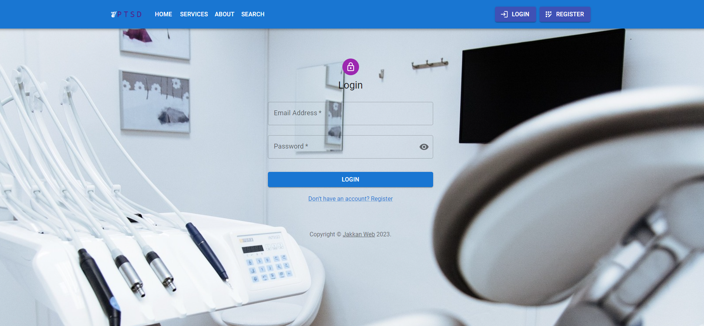
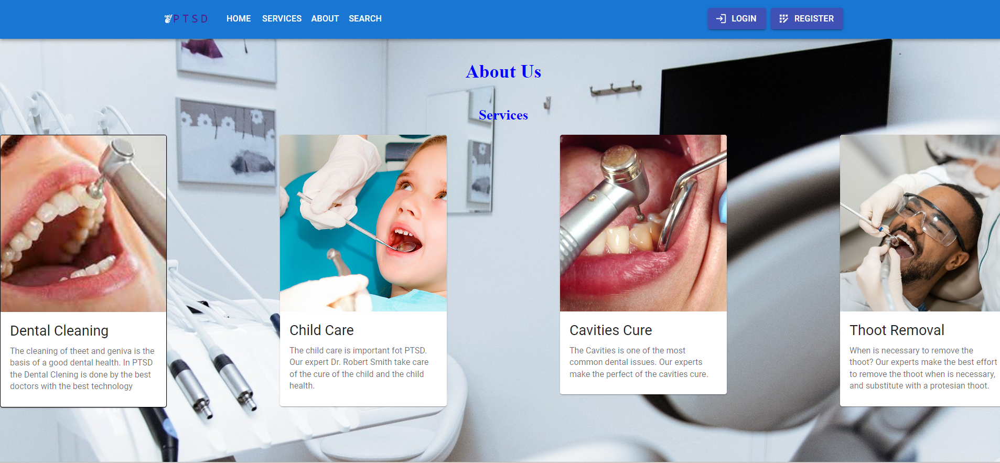

# Proyecto-Frontend Dental Clinic

## Índice

<ul>

<li>Project Description</li>
<li>Deploy</li>
<li>Views</li>
<li>Stack</li>
<li>Proyect Developers</li>

</ul>

## :blue_book:Project Description

The project is the Frontend of the past Backend Project of dental clinic (https://github.com/JoseJakkan/DentalClinic.git). The project includes the following features like Register, Login, a profile for Patients and other for Doctors. The possibility to take an appointment with the clonic, modify thar appointment and search the appointments for the patients and the doctors. Finally, the project has a seccion fot the Admin.

## Deploy

<a href="https://github.com/JoseJakkan/Frontend-DentalClinic.git">Project</a>
</a>

## View

## :wrench:Stack

<ul>
<li>HTML5</li>
<li>CSS3</li>
<li>Sass</li>
<li>JavaScript</li>
<li>React</li>
<li>Redux</li>
<li>MUI</li>
</ul>

## :koala:Proyect Developers

Jose Antonio Lopez
student of GeeksHubs Academy https://geekshubsacademy.com/
:e-mail: lopez.joseantonio82@gmail.com
